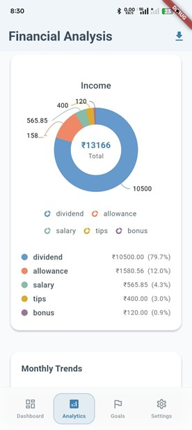
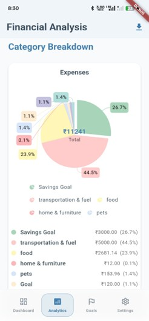
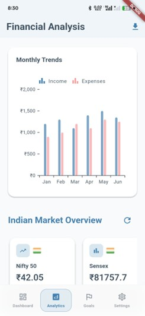

# ML Financial App  

A comprehensive financial management application with machine learning capabilities for **bill scanning, spending analysis, and transaction predictions**.  

---

## 🚀 Overview  

This application provides users with **intelligent financial management tools** powered by machine learning.  
- Track transactions  
- Scan bills automatically  
- Analyse spending patterns  
- Receive AI-powered financial insights  

---

## ✨ Key Capabilities  

- 📷 **Smart Bill Scanning** – Image-powered bill recognition and data extraction  
- 📊 **Intelligent Analytics** – Spending analysis and pattern recognition  
- 🔮 **Predictive Insights** – Financial forecasting and spending predictions  
- 🔐 **Secure Authentication** – Firebase-powered user management with Google Sign-In  

---

## 🛠 Technology Stack  

| Component       | Technology  | Version |
|-----------------|-------------|---------|
| **Frontend**    | Flutter     | Latest  |
| **Backend**     | Node.js     | Latest  |
| **Machine Learning** | Python | 3.x     |
| **Database**    | MongoDB     | Latest  |
| **Authentication** | Firebase Auth | Latest |

---

## 📌 Features  

### 🔑 Authentication Module  
- Secure account creation with email validation  
- One-click **Google Sign-In**  

### 💰 Transaction Management Module  
- Real-time transaction tracking & categorization  
- Comprehensive history with search & filter  
- Interactive charts & graphs  

### 🤖 ML Services Module  
- **Bill Scanning** – Automatic recognition  
- **Data Extraction** – Amounts, dates, merchants  
- **Spending Analysis** – ML-powered insights  
- **Prediction Engine** – Forecasts & budget recommendations  

### 👤 User Profile Module  
- Profile customization & settings  
- Data export in multiple formats  
- Notifications for transactions

## 🖥️ Screenshot

  <table>
    <tr>
      <td></td>
      <td></td>
      <td></td>
    </tr>
    <tr>
      <td></td>
      <td></td>
      <td></td>
    </tr>
    <tr>
      <td></td>
      <td></td>
      <td></td>
    </tr>
  </table>

